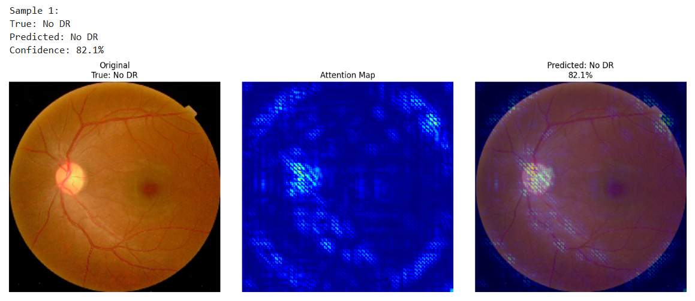

<h1 align="center">Diabetic Retinopathy Detection Using Deep Learning</h1>


Diabetic Retinopathy (DR) is a leading cause of vision impairment worldwide, affecting millions of people with diabetes. Early detection is critical for preventing vision loss, but manual diagnosis requires specialized expertise and is time-consuming.

This project presents an advanced deep learning solution leveraging **EfficientNet** and convolutional neural network, to classify retinal fundus images into five severity levels of DR. The model achieves strong performance through fine-tuning, focal loss for class imbalance, and comprehensive data augmentation, making it well-suited for real-world clinical applications.

<p align="center">
  
</p>

---

## Key Features

- **Five-class classification:** No DR, Mild, Moderate, Severe, and Proliferative DR
- **EfficientNetB3 backbone:** Pre-trained on ImageNet and fine-tuned for optimal accuracy
- **Advanced data augmentation:** Enhances model robustness against varied imaging conditions
- **Focal loss function:** Mitigates class imbalance, improving detection of rare but critical cases
- **TensorFlow Dataset pipeline:** Efficient and scalable data loading with on-the-fly preprocessing
- **Grad-CAM visualization:** Interpretability through heatmaps highlighting image regions influencing predictions

---

## Dataset

The model is trained and validated on the publicly available [APTOS 2019 Blindness Detection Dataset], containing high-resolution retinal images labeled with DR severity levels.

---

## Methodology

1. **Data Exploration:** Analyzed image resolution and class distribution to inform preprocessing.
2. **Preprocessing:** Resized images to 224x224 pixels, normalized pixel values, and applied data augmentation techniques.
3. **Model Architecture:** Built upon EfficientNetB3 with top layers unfrozen for fine-tuning.
4. **Loss Function:** Implemented focal loss to focus learning on challenging and underrepresented classes.
5. **Training:** Used early stopping and learning rate scheduling to prevent overfitting and accelerate convergence.
6. **Evaluation:** Detailed metrics including accuracy, balanced accuracy, Cohen’s Kappa, and class-wise performance.
7. **Interpretability:** Generated Grad-CAM heatmaps to visualize model attention on retinal images.

---

## Results

- **Best Validation Accuracy:** ~74%
- **Balanced Accuracy:** ~50%, highlighting effective learning on imbalanced classes
- **Cohen’s Kappa:** ~0.59, demonstrating substantial agreement beyond chance
- **Per-class performance:** High accuracy on No DR and Moderate classes; ongoing work to improve rare class detection

---

## Grad-CAM Visualizations

The following Grad-CAM heatmaps illustrate how the model focuses on key regions of retinal images when making predictions. This interpretability helps validate that the model attends to medically relevant features.

<p align="center">
  
  
  
</p>

---

## Installation & Usage

Clone the repository and navigate to the project directory:

```bash
git clone https://github.com/priyankaraghunathan15/diabetic-retinopathy-detection.git
cd diabetic_retinopathy_detection
```

Install dependencies (recommended in a virtual environment):

```bash
pip install -r requirements.txt
```

Prepare the dataset:

- Download and extract the **APTOS 2019 Blindness Detection** dataset
- Ensure `train.csv` is available for label mapping

### Train the Model

Run the training pipeline (this uses EfficientNet and focal loss):

```bash
python scripts/train_model.py
```

### Run Inference and Visualize Attention (Grad-CAM)

To generate predictions and Grad-CAM heatmaps on sample validation images:

```bash
python scripts/predict_and_visualize.py
```

> You can also load the pre-trained `.keras` or `.h5` model directly for testing.

---

## File Structure

```
├── data/
│   └── train.csv                     # Labels file
│
├── models/
│   ├── diabetic_retinopathy_model.keras     # Saved model (for deployment or Streamlit)
│   ├── diabetic_retinopathy_model.h5        # Saved model (includes focal loss support)
│   ├── training_history.pkl                 # Pickled training metrics
│   ├── sample_images.npy                    # Sample batch of validation images
│   ├── sample_labels.npy                    # Corresponding sample labels
│   └── focal_loss_function.py               # Custom focal loss implementation
│
├── notebooks/
│   └── diabetic_retinopathy_exploration.ipynb  # EDA, training, metrics, Grad-CAM
│
├── scripts/
│   ├── train_model.py              # Full training pipeline
│   ├── predict_and_visualize.py   # Inference and Grad-CAM visualization
│   └── focal_loss_function.py     # Custom loss (for import and reuse)
│
├── requirements.txt               # Python dependencies
└── README.md                      # Project documentation
```

---

## Download Pretrained Artifacts

> If you're running this outside Kaggle, download these files and place them in the `models/` directory:

- `diabetic_retinopathy_model.keras`
- `diabetic_retinopathy_model.h5`
- `training_history.pkl`
- `sample_images.npy`
- `sample_labels.npy`
- `focal_loss_function.py`

These files are essential for testing, visualization, and deployment.

---

## Future Work

- Improve recall on severe and proliferative DR through enhanced augmentation and balanced sampling
- Experiment with transformer-based architectures and ensemble methods
- Extend interpretability tools to generate textual explanations alongside heatmaps
- Deploy as a web app or mobile solution to aid clinical decision-making globally

---

## Acknowledgments

- The [APTOS 2019 dataset] for providing high-quality labeled images
- TensorFlow and Keras for their comprehensive deep learning frameworks
- The open-source community for invaluable tools and resources

---

*Empowering early diabetic retinopathy detection through cutting-edge AI — one pixel at a time.*
